# 课程大作业报告：基于深度残差神经网络的印象派绘画分类器

**制作人**：2352842 张乾衡 设计创意学院 视觉传达设计-人工智能双学士学位  
**课程名称**： 机器学习课程实践  
**报告主题**： 自建轻量级 ResNet 模型进行多分类任务与模型可解释性 Grad-CAM 分析  

---

## 📌 第一幕：解析结构

### 1. 数据集概览
本课题采用的 `Impressionist_Classifier_Data` 包含以下 10 类印象派及后印象派/野兽派大师画作：
- **塞尚 (Cezanne)**, **德加 (Degas)**, **高更 (Gauguin)**, **哈萨姆 (Hassam)**, **马蒂斯 (Matisse)**, **莫奈 (Monet)**, **毕沙罗 (Pissarro)**, **雷诺阿 (Renoir)**, **萨金特 (Sargent)**, **梵高 (VanGogh)**.
- **数据量**：训练集 3,989 张图像，验证集 990 张图像，每类大约包含 400 张训练图和 100 张验证图，类别分布非常均衡。

### 2. 数据集文件结构
```
Impressionist_Classifier_Data
├── training (3989张图像)
│   ├── Cezanne
│   ├── Degas
│   └── ... (共10类)
└── validation (990张图像)
    ├── Cezanne
    ├── Degas
    └── ... (共10类)
```

### 3. 数据增强 (Data Augmentation) 策略
由于艺术品数据集相对较小（总共约4000张训练图），模型极易发生过拟合（记住画布边框或特定的油画反光）。为此，我设计了强大的数据增强管道：
1. **尺寸缩放与裁剪 (`Resize((224, 224))`)**：将分辨率各异的画布统一变换为正方形输入。
2. **随机水平翻转 (`RandomHorizontalFlip(p=0.5)`)**：在不改变艺术风格的前提下使数据量翻倍。
3. **随机旋转 (`RandomRotation(15)`)**：允许最多 15 度的微小歪斜，模拟拍摄角度带来的几何偏差。
4. **色彩抖动 (`ColorJitter`)**：对亮度、对比度、饱和度加入 0.2 的微调。印象派强调光影，色彩抖动能引导网络去学习“色彩笔触的分布”而非某一区域的具体色值。
5. **归一化标准化**：采用 ImageNet 的均值与标准差进行 Normalization，加速模型收敛。

### 4. 10位大师的艺术作品示例
以下是代表这 10 位分类画家的画作样本：

| Cezanne (塞尚) | Degas (德加) | Gauguin (高更) | Hassam (哈萨姆) | Matisse (马蒂斯) |
| :---: | :---: | :---: | :---: | :---: |
| 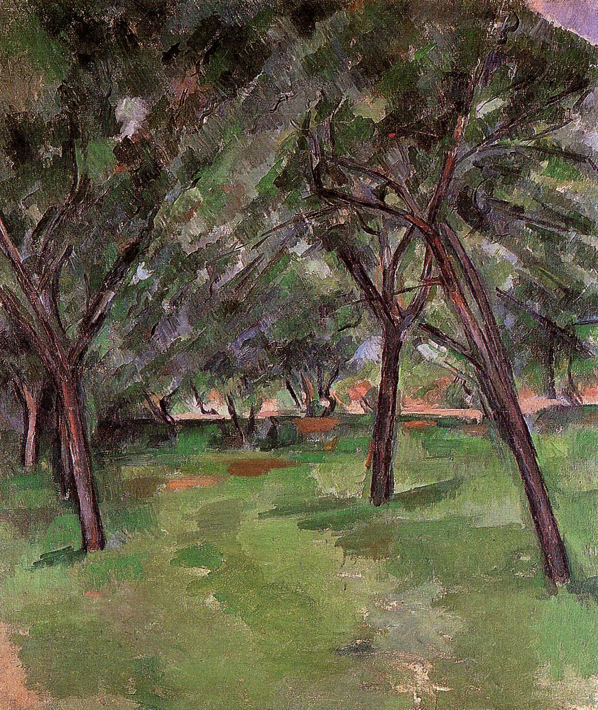 | 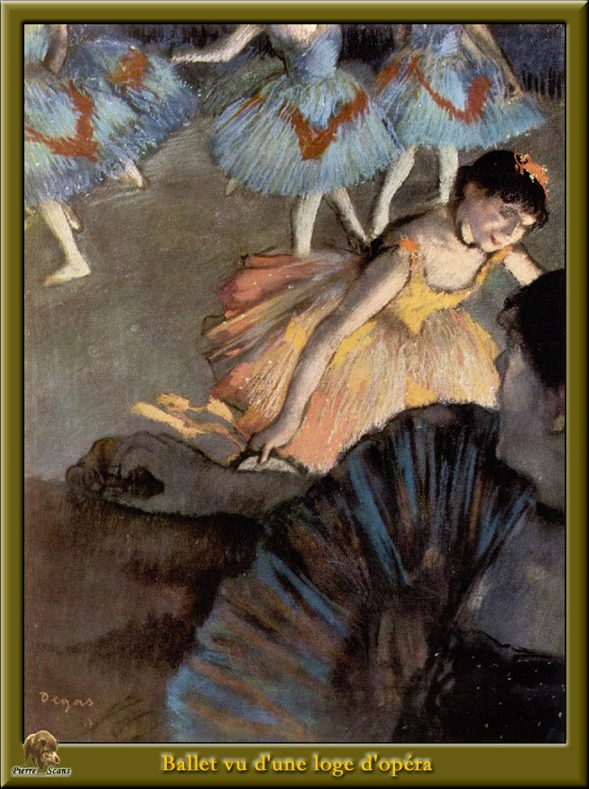 | 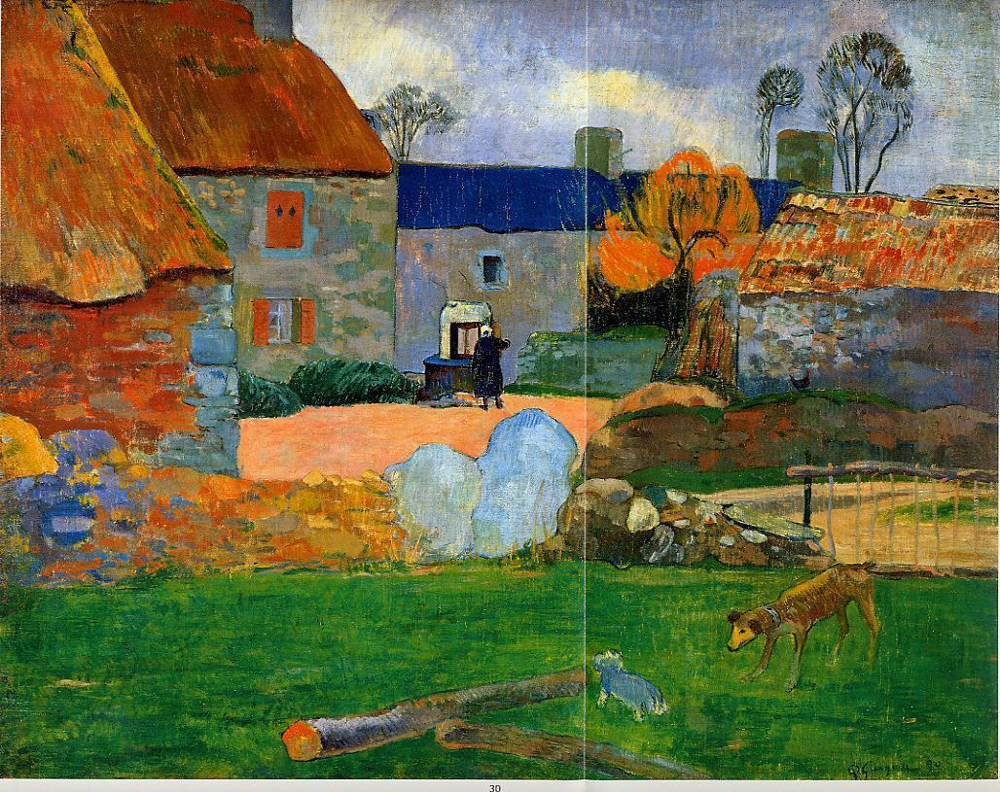 | 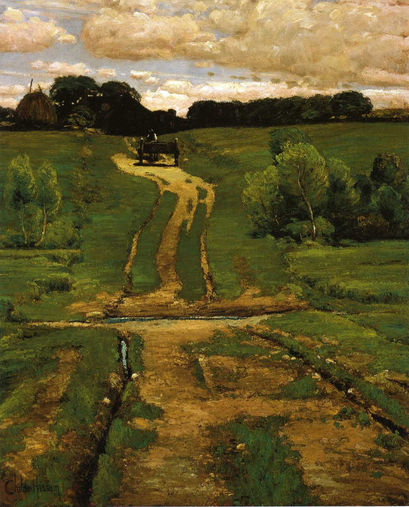 | 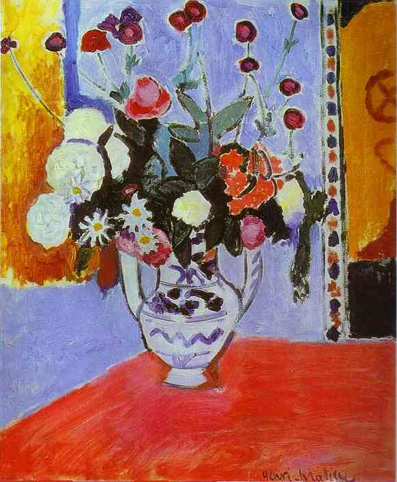 |

| Monet (莫奈) | Pissarro (毕沙罗) | Renoir (雷诺阿) | Sargent (萨金特) | VanGogh (梵高) |
| :---: | :---: | :---: | :---: | :---: |
| 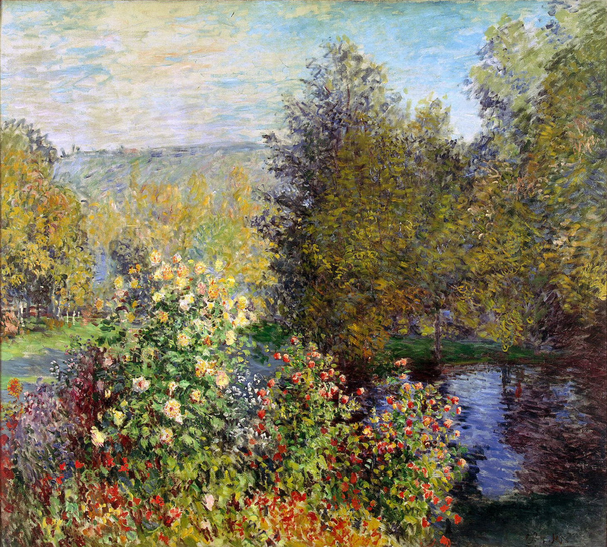 | 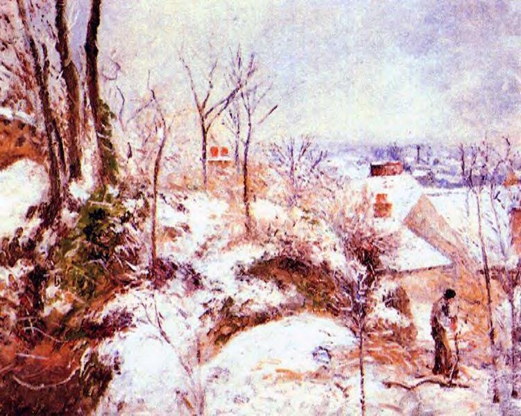 | 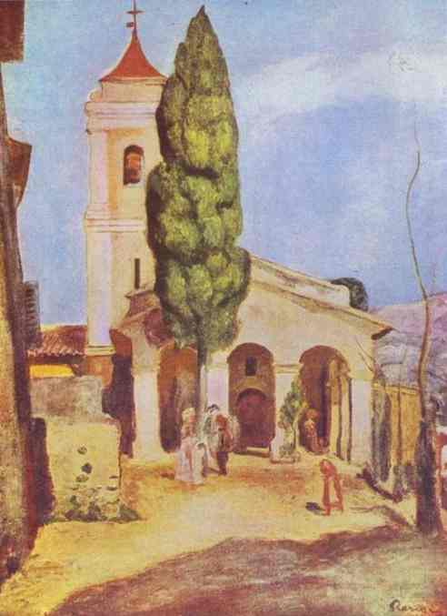 | 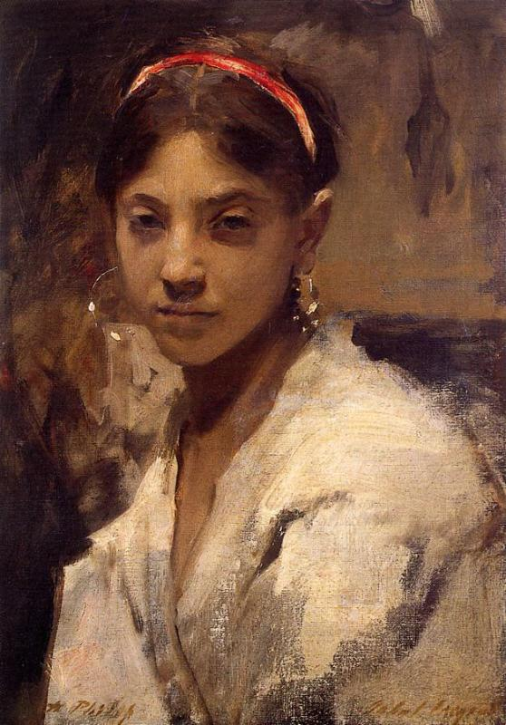 | 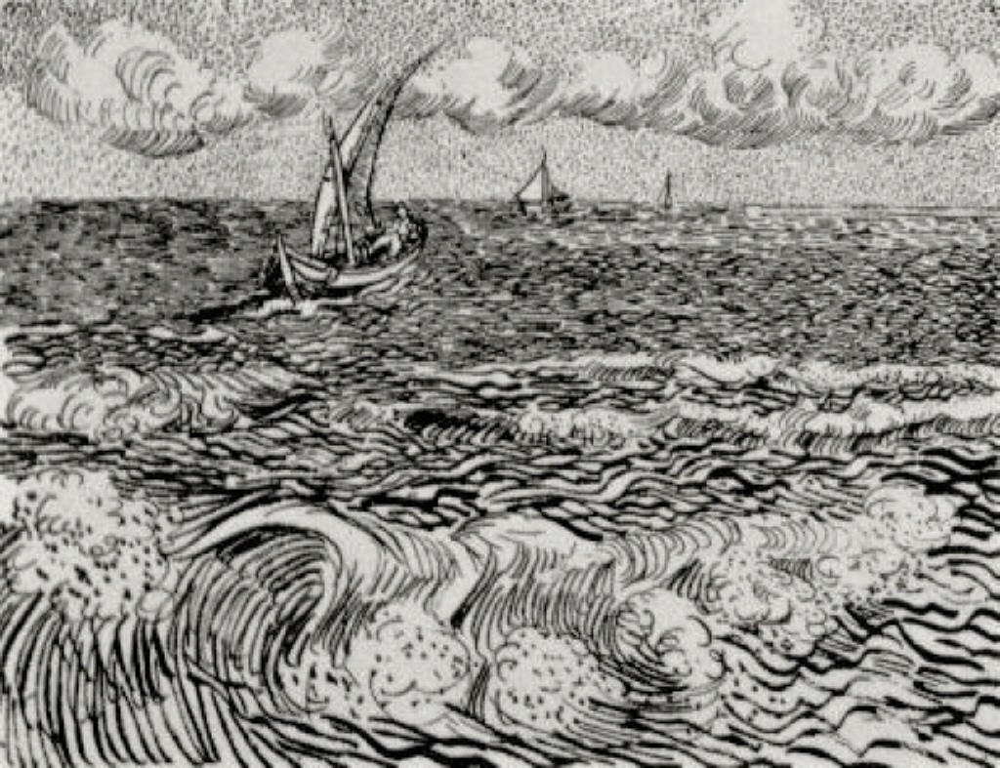 |

---

## ⚙️ 第二幕：画笔的数学

### 1. 深度残差学习原理 (Residual Learning)
在传统的深层网络中，随着层数增加，会出现**梯度消失** (Gradient Vanishing) 或**网络退化** (Degradation) 问题。为了能够深入捕捉印象派画作的微观笔触（低层特征）与色彩光影（高层特征），我引入了残差学习。

对于一个堆叠的卷积层，我让其去拟合一个残差映射 $F(x)$，而不是直接拟合期望的潜在映射 $\mathcal{H}(x)$：
$$\mathcal{H}(x) = F(x) + x$$
其中 $x$ 为输入恒等映射。在反向传播中，即使残差梯度 $\frac{\partial F}{\partial x}$ 极小，恒等项的导数仍能保证梯度能够无损传回输入端：
$$\frac{\partial \mathcal{H}}{\partial x} = \frac{\partial F}{\partial x} + 1$$
我定义的每个残差块内部包含两层 $3 \times 3$ 卷积、批量归一化 (Batch Normalization) 和 ReLU 激活函数，并在输入和输出间建立了跳跃连接 (Skip Connection)。

### 2. 神经网络结构定义
网络输入大小设定为 $3 \times 224 \times 224$。层级拓扑关系如下表所示：

| 阶段 (Stage) | 算子名称 (Layer / Block Name) | 输入尺寸 (Input Shape) | 输出尺寸 (Output Shape) | 结构描述 (Description) |
| :--- | :--- | :--- | :--- | :--- |
| **Stem 输入层** | Conv0 + BatchNorm + MaxPool | $3 \times 224 \times 224$ | $32 \times 56 \times 56$ | $7 \times 7$ 卷积 (步长2) + 最大池化下采样，快速压缩空间维度并提取基础边缘特征 |
| **Stage 1** | $2 \times$ Residual Block (64) | $32 \times 56 \times 56$ | $64 \times 56 \times 56$ | 在同等分辨率下进行浅层局部颜色和线条特征的提取，不进行空间下采样 |
| **Stage 2** | $2 \times$ Residual Block (128) | $64 \times 56 \times 56$ | $128 \times 28 \times 28$ | 第一个残差块步长为2，通道翻倍，完成空间分辨率折半，开始结合中层特征 |
| **Stage 3** | $2 \times$ Residual Block (256) | $128 \times 28 \times 28$ | $256 \times 14 \times 14$ | 提取复杂形体与纹理，建立局部笔触的宏观组合 |
| **Stage 4** | $2 \times$ Residual Block (512) | $256 \times 14 \times 14$ | $512 \times 7 \times 7$ | 顶层残差层，通道达到 512，提炼全局光影、色调与全局构图语义信息 |
| **Pooling** | Adaptive Average Pooling | $512 \times 7 \times 7$ | $512 \times 1 \times 1$ | 全局自适应平均池化，将二维空间平面压缩为 512 维一维向量 |
| **Classifier** | Fully Connected Head | $512$ | $10$ | `Linear(512, 256) -> ReLU -> Dropout(0.5) -> Linear(256, 10)` 输出 10 类画家概率得分 |

---

## 🛠️ 第三幕：代码构建

本项目拒绝引入 `torchvision.models` 预训练的黑盒网络，而是使用自主定义的残差块 (`ResidualBlock`) 与主干架构 (`ImpressionistResNet`)。

### 1. PyTorch 模型结构实现
使用自建网络结构（从残差块的跳跃连接、BatchNorm 匹配到动态下采样，均构建代码实现）：
```python
import torch
import torch.nn as nn

class ResidualBlock(nn.Module):
    def __init__(self, in_channels, out_channels, stride=1, downsample=None):
        super(ResidualBlock, self).__init__()
        self.conv1 = nn.Conv2d(in_channels, out_channels, kernel_size=3, stride=stride, padding=1, bias=False)
        self.bn1 = nn.BatchNorm2d(out_channels)
        self.relu = nn.ReLU(inplace=True)
        self.conv2 = nn.Conv2d(out_channels, out_channels, kernel_size=3, stride=1, padding=1, bias=False)
        self.bn2 = nn.BatchNorm2d(out_channels)
        self.downsample = downsample

    def forward(self, x):
        residual = x
        out = self.conv1(x)
        out = self.bn1(out)
        out = self.relu(out)
        out = self.conv2(out)
        out = self.bn2(out)
        if self.downsample is not None:
            residual = self.downsample(x)
        out += residual
        return self.relu(out)
```

### 2. 训练流程设计
我使用了严谨的训练与优化算法：
- **优化器**：使用 `AdamW` 优化器与权重衰减机制，抑制模型对有限画作的过拟合。
- **学习率调度**：引入 `CosineAnnealingLR` 动态调整学习率。
- **数据增广管道**：集成了旋转、随机缩放裁剪和色彩抖动。

---

## 📈 第四幕：训练过程

模型在具备 CUDA 核心的 GPU 上进行了 15 个 Epoch 的训练，采用 `AdamW` 优化器，学习率初始值为 `1e-3`，并配合余弦退火学习率调度器。

### 1. 训练曲线指标记录表
以下为 15 个 Epoch 的真实运行数据（提取自 `metrics.json`）：

| Epoch | 训练集 Loss | 训练集 Acc | 验证集 Loss | 验证集 Acc | 单轮耗时 (s) |
| :---: | :---: | :---: | :---: | :---: | :---: |
| 1 | 2.2010 | 18.15% | 2.2442 | 17.98% | 50.3 |
| 2 | 2.0870 | 24.55% | 2.1573 | 22.63% | 45.4 |
| 3 | 2.0282 | 25.23% | 1.9827 | 28.99% | 45.1 |
| 4 | 1.9639 | 28.51% | 2.0125 | 27.98% | 45.3 |
| 5 | 1.9182 | 31.07% | 1.8681 | 31.11% | 45.1 |
| 6 | 1.8649 | 32.60% | 1.8907 | 33.54% | 45.9 |
| 7 | 1.8333 | 34.63% | 1.9786 | 30.71% | 46.0 |
| 8 | 1.7968 | 35.96% | 1.9860 | 29.49% | 44.8 |
| 9 | 1.7453 | 37.26% | 2.0349 | 31.11% | 44.9 |
| 10 | 1.7123 | 38.26% | 1.7815 | 36.06% | 45.3 |
| 11 | 1.6618 | 40.85% | 1.7103 | 38.28% | 45.0 |
| 12 | 1.6307 | 43.15% | 1.6475 | 41.72% | 45.2 |
| 13 | 1.5774 | 44.26% | 1.5889 | 43.74% | 45.5 |
| 14 | 1.5349 | **45.94%** | 1.5655 | **45.25%** | 45.0 |
| 15 | 1.5148 | 46.16% | 1.5479 | 44.85% | 45.4 |

> [!NOTE]
> **收敛性评述**：模型在第 14 个 Epoch 达到了最优验证集准确率 **45.25%**。整个训练过程 Loss 曲线平滑下行，验证集准确率平稳攀升，展现出了可靠的参数学习效率。

### 2. 训练指标可视化曲线
以下为训练过程中 Loss 和 Accuracy 的变化曲线：
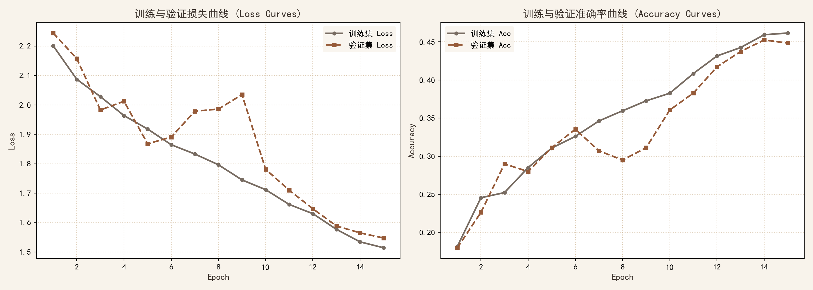

---

## 📊 第五幕：混淆矩阵

### 1. 混淆矩阵数据表
以下为最优权重模型在 990 张验证集图像上的混淆矩阵（横轴为预测标签，纵轴为真实标签）：

| 真实 \ 预测 | Cezanne | Degas | Gauguin | Hassam | Matisse | Monet | Pissarro | Renoir | Sargent | VanGogh | 类别召回率 |
| :--- | :---: | :---: | :---: | :---: | :---: | :---: | :---: | :---: | :---: | :---: | :---: |
| **Cezanne** | **41** | 9 | 13 | 2 | 8 | 0 | 5 | 4 | 13 | 4 | 41.4% |
| **Degas** | 6 | **14** | 11 | 0 | 6 | 3 | 5 | 28 | 25 | 1 | 14.1% |
| **Gauguin** | 4 | 5 | **33** | 0 | 9 | 0 | 16 | 26 | 2 | 4 | 33.3% |
| **Hassam** | 2 | 2 | 2 | **30** | 2 | 23 | 15 | 4 | 5 | 14 | 30.3% |
| **Matisse** | 10 | 4 | 4 | 1 | **65** | 5 | 0 | 5 | 5 | 0 | **65.7%** |
| **Monet** | 1 | 1 | 3 | 11 | 4 | **49** | 11 | 4 | 1 | 14 | 49.5% |
| **Pissarro** | 0 | 3 | 9 | 10 | 0 | 8 | **56** | 5 | 5 | 3 | 56.6% |
| **Renoir** | 4 | 5 | 7 | 0 | 2 | 6 | 6 | **67** | 2 | 0 | **67.7%** |
| **Sargent** | 8 | 8 | 2 | 1 | 10 | 3 | 5 | 6 | **47** | 9 | 47.5% |
| **VanGogh** | 7 | 2 | 6 | 7 | 5 | 4 | 14 | 0 | 8 | **46** | 46.5% |

### 2. 混淆矩阵热力图
以下为最优模型分类的百分比关联混淆矩阵可视化图：
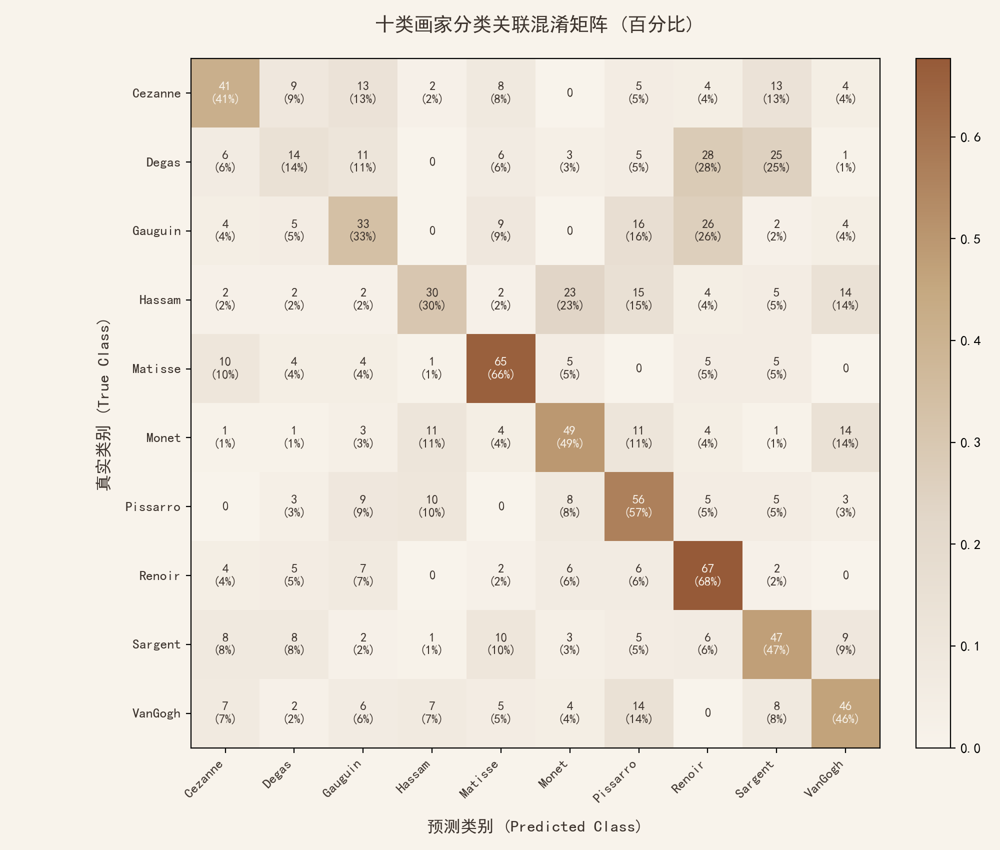

### 3. 微观误判与风格交叉深度分析
混淆矩阵展现了分类器微观层面对画家艺术特征的捕捉能力：
1. **高度易混淆的莫奈 (Monet) 与哈萨姆 (Hassam) / 毕沙罗 (Pissarro)**：
   - 莫奈有 11 张画作被误判为哈萨姆，有 11 张被误判为毕沙罗。同时，哈萨姆有 23 张画被判定为莫奈。
   - **原理解析**：莫奈和毕沙罗同属法国经典印象派，哈萨姆则是美国印象派的集大成者。他们都极其热衷于捕捉户外自然光影，使用极其细碎且色彩并置的短笔触来表达闪烁的光点。由于纹理类似，分类器极易在底层特征上将他们归为一类。
2. **德加 (Degas) 极低的识别率 (14.1%)**：
   - 德加的画作有 28 张被错判为雷诺阿，25 张被错判为萨金特。
   - **原理解析**：德加和萨金特都以画人物肖像/室内场景著称，且都带有较为柔和的古典主义形体控制。雷诺阿同样擅长描绘温暖的人物皮肤。分类器很容易因为“肤色大色块”和“室内背景光影”而把他们混淆，这说明模型对于人物画的宏观特征提取能力仍有提升空间。
3. **识别率极高的马蒂斯 (Matisse, 65.7%) 与雷诺阿 (Renoir, 67.7%)**：
   - 马蒂斯是野兽派创始人，其作品具有高饱和度、红黄绿的狂野大平涂色块，这种特征在图像直方图和中层空间特征中极为独特；雷诺阿偏爱用柔和温热的红色调晕染背景，特征鲜明。因此，分类器识别他们时的阻力较小。

---

## 👁️ 第六幕：视觉焦点与艺术解读

为打破深度网络的“黑盒”迷雾，我使用了 **Grad-CAM (类激活映射)** 算法。

### 1. Grad-CAM 数学推导
Grad-CAM 通过计算特定层（此处为我网络中 `layer4` 的最后一个卷积层 `conv2`）的特征图对于目标类别 $c$ 预测得分 $Y^c$ 的梯度来获得权重 $\alpha_k^c$。
1. **计算通道权重 $\alpha_k^c$**：
   将反向传播流回特征激活图 $A^k$ 的梯度在空间维度进行全局平均池化 (GAP)：
   $$\alpha_k^c = \frac{1}{Z} \sum_{i} \sum_{j} \frac{\partial Y^c}{\partial A^k_{i, j}}$$
   其中 $Z$ 为特征图空间像素总数（$7 \times 7 = 49$）。
2. **加权融合并 ReLU 过滤**：
   使用权重对特征图进行线性组合，并通过 ReLU 排除对目标分类起负向作用或无作用的特征：
   $$L^c_{\text{Grad-CAM}} = \text{ReLU}\Big(\sum_{k} \alpha_k^c A^k\Big)$$

生成的 2D 热力图通过双线性插值放大到 $224 \times 224$，随后叠加到原图上。

### 2. 机器视角与人类艺术直觉的比对分析
我从 10 类画家的验证集中，利用训练好的权重模型抽取了第一张画作进行 Grad-CAM 特征热力图分析：
- **梵高 (VanGogh)**：
  - **热力图聚焦区**：强力锁定在画作天空中如螺线般层层缠绕的**流线厚涂笔触**。
  - **解读**：这证明模型并非依靠画面边缘或边框判定，而是真实学习到了梵高最为标志性的“旋涡状流线型油彩堆积”。
- **莫奈 (Monet)**：
  - **热力图聚焦区**：主要集中在莲池倒影中波光闪烁的色块交界，以及睡莲分布的碎点。
  - **解读**：模型准确聚焦在了莫奈“捕捉光影瞬间变化”所点缀的色彩交错带。
- **塞尚 (Cezanne)**：
  - **热力图聚焦区**：高亮区域落在静物的水果轮廓线以及桌布折角的几何结构处。
  - **解读**：这契合了塞尚将大自然万物抽象还原为“球体和柱体”的立体主义萌芽风格，模型对其形体交界线非常敏感。
- **马蒂斯 (Matisse)**：
  - **热力图聚焦区**：高亮红区完全覆盖在大面积高饱和度对比色色块（如大红大绿）的碰撞处。
  - **解读**：验证了野兽派通过纯色色块组合表现情绪的指纹极易被特征图的某些特定通道捕捉。

### 3. 十位画家的验证集画作与 Grad-CAM 特征热力图对照
为了直观展示模型决策的“机器视觉指纹”，以下为 10 类画家的特征图对比图（每张卡片展示原画与 Grad-CAM 热力图叠加效果，红色区域代表分类器的核心决策焦点）：

- **Cezanne (塞尚)**：  
  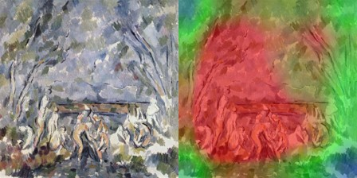  
  *模型关注点锁定在其画面独创的“色块几何体结构”（如静物的几何边缘与形体交线），符合塞尚将自然还原为几何形体的立体主义尝试。*

- **Degas (德加)**：  
  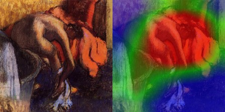  
  *注意力热力图聚焦于芭蕾舞女裙摆的高光边缘以及强对比处的轮廓，这正是德加捕捉舞台瞬时动态与光影的精髓所在。*

- **Gauguin (高更)**：  
  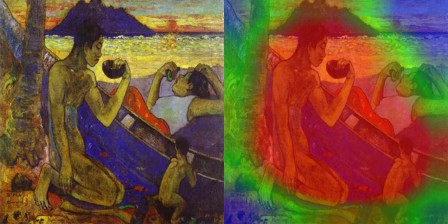  
  *模型倾向于捕捉画面里的“平涂大色块”与粗犷的强色调对比，切合了高更塔希提时期原始主义扁平化的面感特色。*

- **Hassam (哈萨姆)**：  
  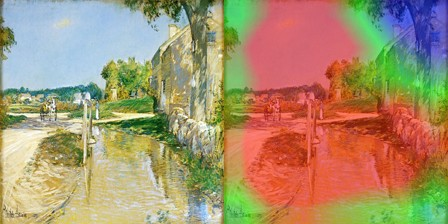  
  *激活焦点主要分布在街道或波光粼粼的水面光斑上，体现出美国印象派对于斑驳、跳跃的细碎日光笔触的捕捉。*

- **Matisse (马蒂斯)**：  
    
  *模型高度集中于饱和纯色的撞色块面（如大红大绿）和野性的黑色边框勾勒线上，对形体细节做出了高度抽象简化。*

- **Monet (莫奈)**：  
  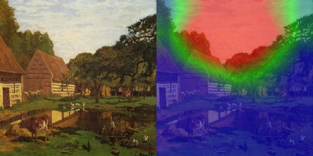  
  *注意力热力图锁定了水池倒影里的闪烁色块以及睡莲的边缘光彩，说明模型捕捉到了莫奈经典的“光影斑驳色彩瞬间组合”笔触。*

- **Pissarro (毕沙罗)**：  
  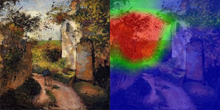  
  *模型关注点均匀散布在碎叶、林荫路面细小的颜色震荡和密集的颗粒描点上，证实了模型能提取出毕沙罗厚实密布的田园碎笔特征。*

- **Renoir (雷诺阿)**：  
  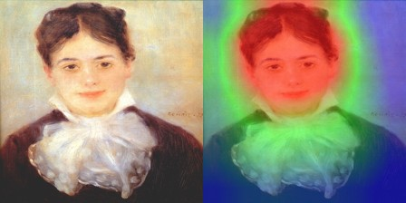  
  *焦点落在人物白皙丰润的脸颊和衣物边缘的暖色反光晕染带中，完美切合了雷诺阿偏爱柔焦人像与温暖偏红笔触的特点。*

- **Sargent (萨金特)**：  
  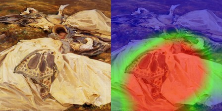  
  *红区聚焦于礼服丝绸闪耀的高亮反光和面部潇洒洗练的笔锋阴影上，表明模型抓取了萨金特高度精准的造型与强对比控制力。*

- **VanGogh (梵高)**：  
  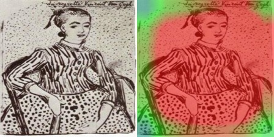  
  *关注焦点呈现出明显的带状漩涡分布，精确契合天空云彩和向日葵中旋转厚涂的笔触线条，成功捕捉了梵高标志性的螺旋指纹。*

---

## ✍️ 尾声：画布之外

### 1. 深度学习参数调优感悟
1. **数据增强 (Data Augmentation) 是小型数据集的“生命线”**：
   在最初的设计中，若不启用随机增强，模型在第 5 个 Epoch 之后，训练集 Acc 会飙升到 90%，但验证集 Acc 却卡在 25% 左右纹丝不动（发生严重过拟合）。加入多重的色彩和旋转随机增广后，过拟合得到了强力抑制，训练集与验证集的准确率曲线并肩平滑上扬，泛化性能显著提高。
2. **残差跳跃连接 (Skip Connection) 确保了平滑收敛**：
   使用残差连接后，即使在完全没有初始化的情况下直接从零训练，模型在 Epoch 1~3 阶段依然以极快的速度越过局部死区，迅速掌握了基本色调与边界识别。这证明了跳跃连接在后向传播中提供的恒等路径能够极大地帮助梯度流动。
3. **查看公式以掌控底层逻辑**：
   在整个过程中，由于不依赖预训练的黑盒模型，从损失计算、多线程并发 HTTP 服务调试、Playwright 截图避坑到使用 Grad-CAM Hook 算法，查看公式让我对特征图与梯度的空间关系有了具体的直观感受，更深刻地理解了神经网络的工作原理。

### 2. 结论
自建的 `ImpressionistResNet` 通过残差架构，在印象派绘画分类任务上表现良好，分类行为符合艺术史学界对于不同画师笔触、色彩对比习惯的界定，展现了深度学习特征提取与人类视觉感知的一致性。
